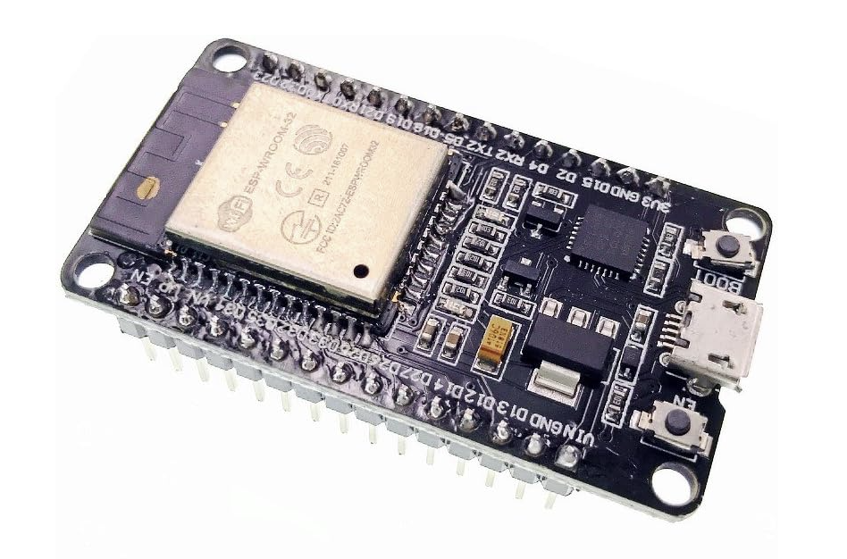

# Home Assistant Door Sensor (ESP32)

I wanted to create a DIY door sensor. This can be completed by using some inexpensive parts.
This has been linked in Home Assistant via the ESP Home module. This is Wifi based and has pretty decent range.


## Parts used

Magnetic Reed Switch


https://www.amazon.co.uk/dp/B0CCPDV239?psc=1&ref=ppx_yo2ov_dt_b_product_details

ESP32DEV board



https://www.amazon.co.uk/gp/product/B071JR9WS9/ref=ppx_yo_dt_b_asin_title_o03_s00?ie=UTF8&psc=1

## Wiring Diagram

From the Magnetic Reed Switch one connection (does matter which one) connects to the GPIO4 and the other to the CMD pin.


Then in Home Assistant you will need to add the following code: 

## Make sure you update any secret references with your own parameters otherwise the code will not work!

```
substitutions:
  device_name: "door-sensor"
  friendly_name: "Door Sensor"
  device_description: "Simple open or close door sensor"
  settings_skipped_updates: "4"

esphome:
  name: "${device_name}"
  friendly_name: "${friendly_name}"
  comment: '${device_description}'

esp32:
  board: esp32dev
  framework:
    type: arduino

# Enable Home Assistant API
api:
  encryption:
    key: !secret doorsensor_api_encryption_key

ota:

wifi:
  ssid: !secret doorsensor_wifi_ssid
  password: !secret doorsensor_web_server_password

  # Enable fallback hotspot (captive portal) in case wifi connection fails
  ap:
    ssid: "${device_name}"
    password: !secret Fallback_Wifi_Password_doorsensor

web_server:
  port: 80
  auth:
    username: !secret garage_web_server_username
    password: !secret garage_web_server_password
  ota: true

# Enable logging
logger:
  baud_rate: 115200
  tx_buffer_size: 512
  deassert_rts_dtr: false
  hardware_uart: UART0
  level: DEBUG
  logs: {}
captive_portal: {}
binary_sensor:
- platform: gpio
  pin:
    number: 4
    mode:
      input: true
      pullup: true
      output: false
      open_drain: false
      pulldown: false
    inverted: false
  name: Garage Entry Door
  device_class: door
  filters:
  - delayed_on: 10ms
  disabled_by_default: false

# Home Assistant Switch Entity allowing restart of ESP32
switch:
  - platform: restart
    name: "Restart"

```

You can then setup a simple node red flow to alert when the door is open or closed.


State Node


Limit Node


Google TTS Node


I then printed out this rather good ESP32 holder from Thingiverse, this give you the ability to plug in a Micro USB connector and feed in the Magnetic Reed Switch wires. https://www.thingiverse.com/thing:3195951

