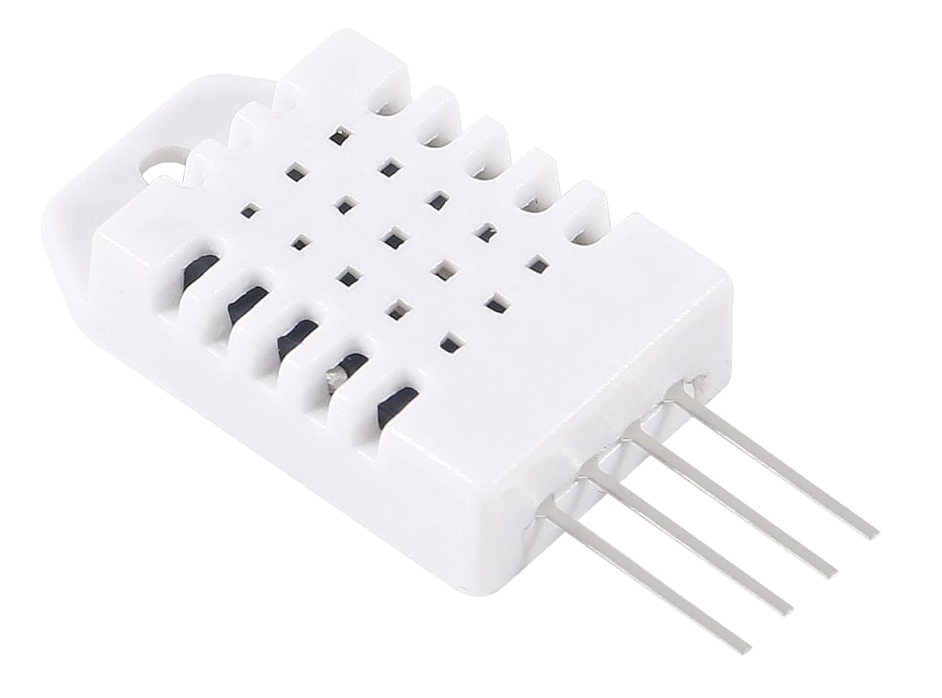
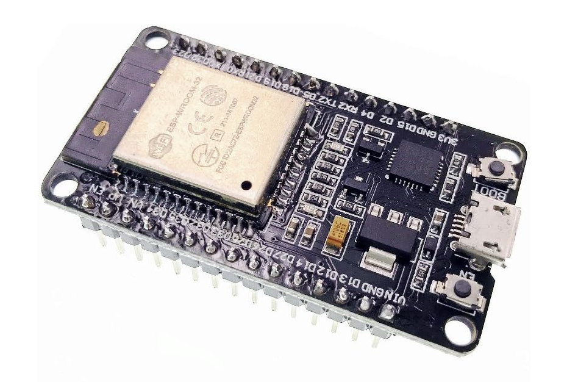
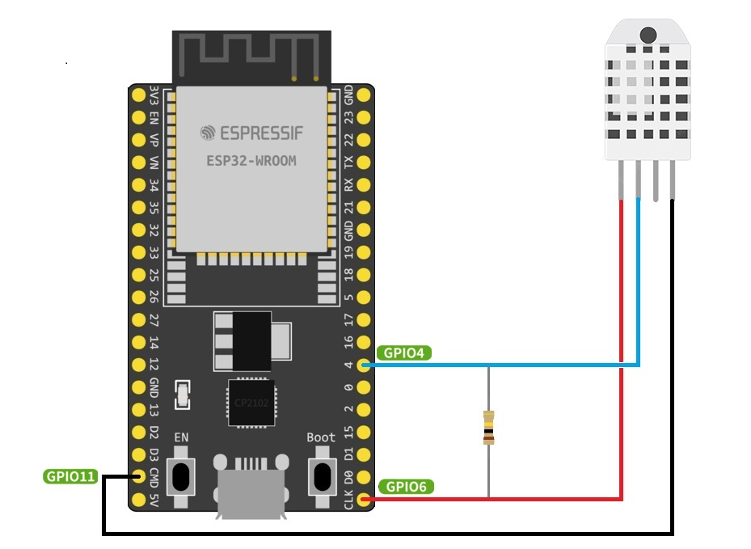
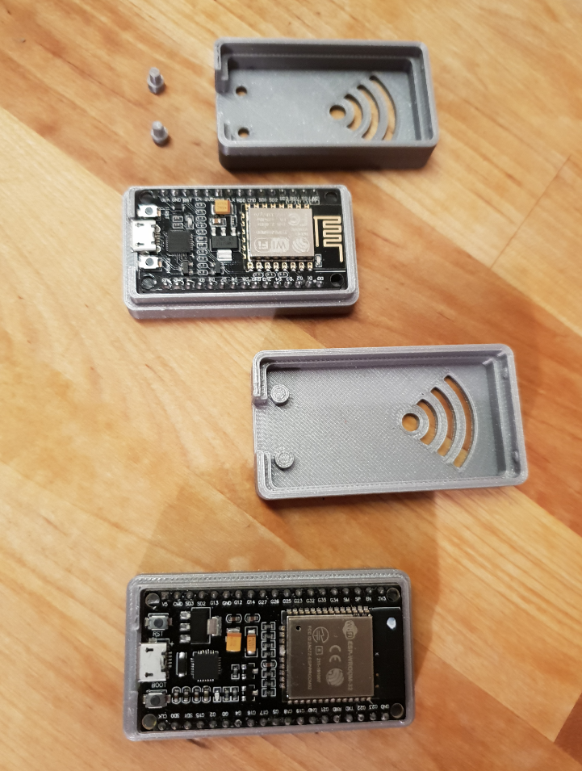
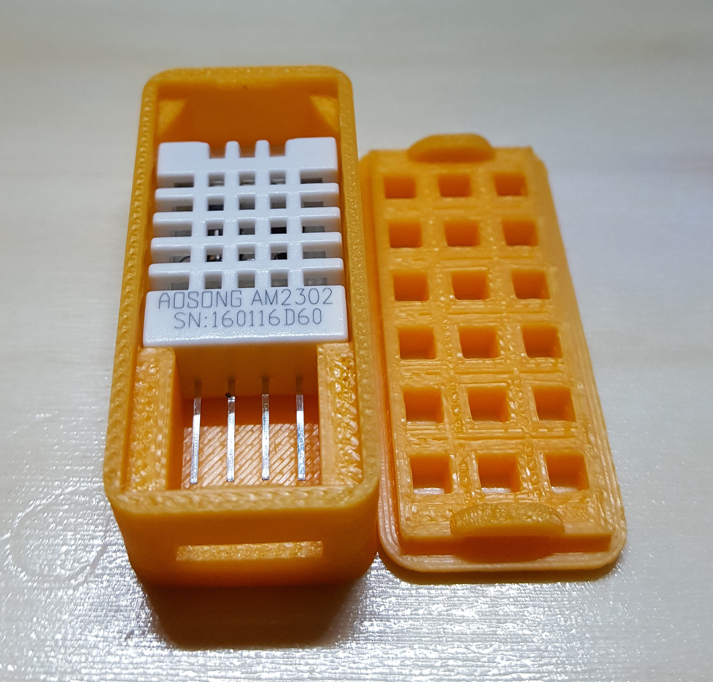
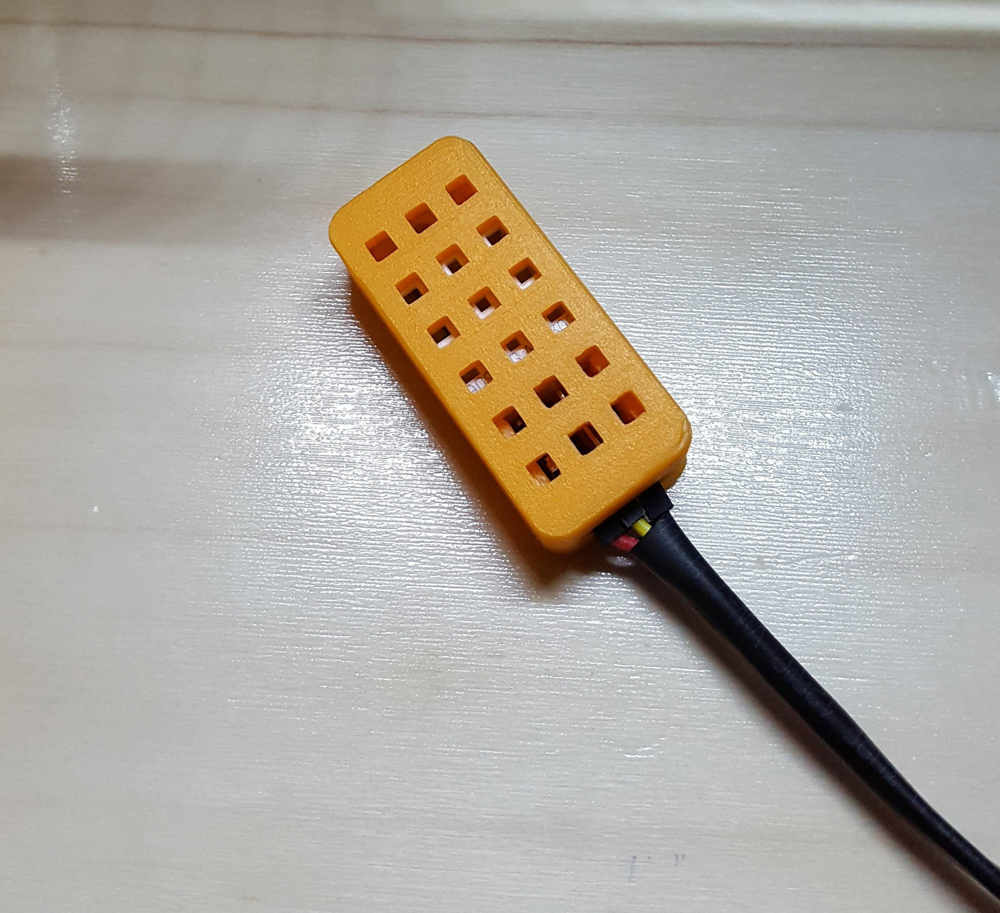
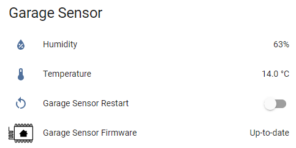

# Home Assistant Temperature and Humidity sensor (ESP32)

These instructions show you how to build a temperature and humidity sensor for Home Assistant.
The parts are cheap.


## Parts used

DHT22 Digital Temperature and Humidity Sensor



https://www.amazon.co.uk/gp/product/B091CDDW2F/ref=ppx_yo_dt_b_asin_title_o05_s00?ie=UTF8&th=1

ESP32DEV board



https://www.amazon.co.uk/gp/product/B071JR9WS9/ref=ppx_yo_dt_b_asin_title_o03_s00?ie=UTF8&psc=1

Pull down resistors (10k)


https://www.amazon.co.uk/250V-Axial-Lead-Carbon-Resistors/dp/B0087ZDSV8/ref=sr_1_7?crid=10CFTZGZ6SNFB&keywords=10k+resistor&qid=1706470838&s=industrial&sprefix=10k+res%2Cindustrial%2C75&sr=1-7

## Wiring Diagram

From the DHT22 module. 

Pin 1 to GPIO6
Pin 2 to GPIO4
Pin 4 to GPIO11

With a pull down resistor between GPIO4 and GPIO6



Then in Home Assistant you will need to add the following code: 

## Make sure you update any secret references with your own parameters otherwise the code will not work!

```

substitutions:
  device_name: "garage_sensor"
  friendly_name: "Garage Sensor"
  device_description: "Logs humidty and temperature in the garage"
  settings_skipped_updates: "4"

esphome:
  name: "${device_name}"
  friendly_name: "${friendly_name}"
  comment: '${device_description}'

esp32:
  board: esp32dev
  framework:
    type: arduino

# Enable logging
logger:

# Enable Home Assistant API
api:
  encryption:
    key: !secret garage_api_encryption_key

# OTA Updates Password 
ota:
  - platform: esphome
    password: !secret garage_sensor_ota_password
  
  

web_server:
  port: 80
  auth:
    username: !secret garage_web_server_username
    password: !secret garage_web_server_password


wifi:
  ssid: !secret wifi_ssid
  password: !secret wifi_password

  # Enable fallback hotspot (captive portal) in case wifi connection fails
  ap:
    ssid: "${device_name}"
    password: !secret Fallback_Wifi_Password_garage

captive_portal:

sensor:
  - platform: dht
    model: DHT22
    pin: GPIO23
    temperature:
      name: "Temperature"
    humidity:
      name: "Humidity"
    update_interval: 30s

  - platform: wifi_signal           
    name: "${friendly_name} WiFi Status"
    update_interval: 60s
    entity_category: diagnostic
  
# Enable restart of ESP32
switch:
  - platform: restart
    name: "Restart"
```

I printed out this case which I found on Thingiverse https://www.thingiverse.com/thing:3195951



And then paried it up with this DHT22 holder again which I found on Thingiverse https://www.thingiverse.com/thing:1520129






There are versions where you can combine the DHT22 sensor and ESP32Dev board into one holder, however I found the ESP board gave off heat which skewed the temperature sensors accuracy.
