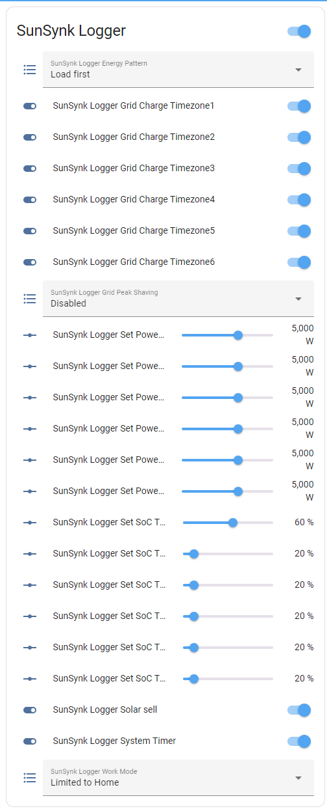
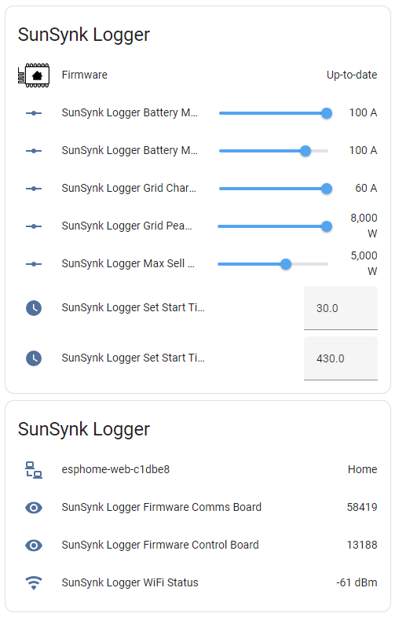
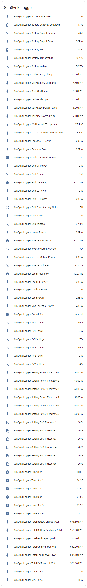

# SunSynk Inverters and Home Assistant ESPHome

This project has been created to allow you to take local control over your SunSynk Inverter. 
The Sunsynk inverter generally comes with a dongle that is connected to the serial port on the bottom of the inverter. 
This dongle connects to Wifi and sends data to SunSynk Cloud which can be it's achilies heel. If the SunSynk cloud is down you loose the ability to remote set or view settings on the inverter also it's been known for the time on the incerter to drift.
This project gives the user the ability to control the inverter from Home Assistant. This applies to 3.68kW / 5.5kW and 8.8kW inverters. (Other models may work)
<br>

**It should be noted, there are different versions of the inverters. Some have an all in one BMS 485/CAN port like a picture of this 8.8kW SunSynk Inverter**


**Some have seperate CAN and RS485 ports like this picture of a 5.5kW SunSynk Inverter**


<br>

Pre-reqs for this project are the following:

* Home Assistant has been setup and you are confortable with adding new sensors and plugins.
* Access to a solidering kit as you will be using this to wire the board.
* Access to a 3D printer to print out the enclosures, this is not strictly required but a nice to have.

## Components required

<br>

WEMOS ESP32 Lite V1.0.0 Lolin32 Wifi Bluetooth Board CH340G MicroPython.


https://kunkune.co.uk/shop/esp32-esp8266/wemos-lolin32-esp32-lite-v1-0-0-wifi-bluetooth-board-ch340g-micropython/?fbclid=IwAR130c3W75-MvHVIQRkaq919oVmQM71DfNW_I4CI16sr6qBjoB76vTmjVCs

<br>

RS485 module to TTL with Isolation Single Chip Microcontroller UART Serial Port.


https://kunkune.co.uk/shop/communication-boards/rs485-module-to-ttl-with-isolation-single-chip-microcontroller-uart-serial-port/?fbclid=IwAR0-Ap4bn00M6TSlwINBr1PfITM7QJWwbq9NOitrLwNkRpegcCKPePa97Lg

A network lead that with RJ45 connectors, various lengths available and these are generally cheap, typically around £5 or less.


A suitable USB power supply and enclosure.

I also created a 3D printed box which can be downloaded from here https://www.thingiverse.com/thing:6456451


<br>

## For the SunSynk Inverters with an all in one BMS 485/CAN port
<br>


You should use these pins and coloured cables


They should be wired like this


You will also be required to splice the cable or purchase an RJ45 splitter* 
The reason behind this is you will not only connect in the ESP32 but you will also need to connect in the existing battery BMS cable.
Luckily the ESP use pins 1 & 2 and the BMS uses pins 4 & 5.


<br>

## *Not all splitters are equal. 

In this version you can see it's crossed over, this will NOT work.


You will need one like this https://solar-assistant.io/shop/products/deye_rj45_split


<br>

## For the SunSynk Inverters with separate CAN & RS485 Ports.
<br>


You can see with a torch behind th cicuit board the pinouts are different


So based on the above you should use these pins and coloured cables


They should be wired like this


<br>

## Inverter Settings

Under the Advance Tab ensure the following settings are set.
Your inverter will need to be rebooted as it will drop into error mode. Once done your inverter will be back to normal.


<br>

## Flashing the ESP with the Code

Load up the ESPHome Add-ons in Home Assistant.


Click on the **ESPHome** in the Home Assistant Side Bar
Now click on **+ New Device**
Click **Open ESPHome Web**
Now plug your ESP device into your PC with a Data Micro USB cable then click **Connect**

Your device should appear as a COM device, if not check this https://bromleysat.com/installing-drivers-for-the-esp32 for help
You will then be prompted to install the ESP device. Following this through.

Once install you will then need to Edit the ESP device in ESP home and then paste in the code https://github.com/iendicott/Home-Assistant/blob/main/SunSynk%20Local%20Control/ESP%20Inverter.yaml

You will need to replace add **!secret** into your Home Assistant config for the code to work.

## Connection

Now plug the device via the RJ45 into the inverter and you should see data being displayed, there will also be 2 LEDs on the RS485 to TTL that flash to show communication to the inverter.


You will also have alot of new sensors in Home Assistant with the Prefix **sunsynk logger**

<br>

## Home Assistant Sensors.


<br>

<br>


Once you have built the product you'll need to install ESP Home on your Home Assistant console and then upload this to your ESP device 
https://github.com/iendicott/Home-Assistant/blob/main/SunSynk%20Local%20Control/ESP%20Inverter.yaml

<br>

## To sync the inverter to the Home Assistant time

Firstly turn off the automatic **Time Syncs** on your inverter, this can be completed on the inverter or through the online portal (shown below).


The code has already been added to the **Inverter.yaml** file you used earlier starting with, if not the code is below.


You must updated the **inverter_id** with your inverter ID, this can be found from this code

```
modbus_controller:
  - id: sunsynk
```

So where it specifies **inverter_id** in the code below, select this and replace this with the value you get above, for example 

```
esphome::modbus_controller::ModbusController *controller = id(sunsynk)
```

```
interval:
  - interval: 3600s         #Set the interval to sync your inverter time with HA or comment out to disable
    then:
      - lambda: |-
          esphome::modbus_controller::ModbusController *controller = id(inverter_id)
          time_t now = ::time(nullptr);
          struct tm *time_info = ::localtime(&now);
          int seconds = time_info->tm_sec;
          int minutes = time_info->tm_min;
          int hour = time_info->tm_hour;
          int day = time_info->tm_mday;
          int month = time_info->tm_mon + 1;
          int year = time_info->tm_year;
          year = year + 1900;
          int year1 = year - 2000;
         
          uint16_t reg22_value = (year1 << 8) | month;
          uint16_t reg23_value = (day << 8) | hour;
          uint16_t reg24_value = (minutes << 8) | seconds;
         
          if (year != 1970) {
            std::vector<uint16_t> rtc_data = {reg22_value, reg23_value, reg24_value};
            esphome::modbus_controller::ModbusCommandItem set_rtc_command =
                esphome::modbus_controller::ModbusCommandItem::create_write_multiple_command(controller, 22, rtc_data.size(), rtc_data);
            controller->queue_command(set_rtc_command);
            ESP_LOGI("Time Sync", "Seconds: %d, Minutes: %d, Hour: %d, Day: %d, Month: %d, Year: %d", seconds, minutes, hour, day, month, year);
          }


binary_sensor:   
  - platform: homeassistant               # Adhoc Time Sync 22 - 24 Sync Inverter Time
    entity_id: input_boolean.sync_inverter_time
    name: "Sync Time"
    id: sync_time
    on_press:
      then:
        - lambda: |-
            esphome::modbus_controller::ModbusController *controller = id(inverter_id);
            time_t now = ::time(nullptr);
            struct tm *time_info = ::localtime(&now);
            int seconds = time_info->tm_sec;
            int minutes = time_info->tm_min;
            int hour = time_info->tm_hour;
            int day = time_info->tm_mday;
            int month = time_info->tm_mon + 1;
            int year = time_info->tm_year;
            year = year + 1900;
            int year1 = year - 2000;
            
            uint16_t reg22_value = (year1 << 8) | month;
            uint16_t reg23_value = (day << 8) | hour;
            uint16_t reg24_value = (minutes << 8) | seconds;
            
            if (year != 1970) {
              std::vector<uint16_t> rtc_data = {reg22_value, reg23_value, reg24_value};
              esphome::modbus_controller::ModbusCommandItem set_rtc_command =
                  esphome::modbus_controller::ModbusCommandItem::create_write_multiple_command(controller, 22, rtc_data.size(), rtc_data);
              controller->queue_command(set_rtc_command);
              ESP_LOGI("Time Sync", "Seconds: %d, Minutes: %d, Hour: %d, Day: %d, Month: %d, Year: %d", seconds, minutes, hour, day, month, year);
            }
```

This will sync the inverter time every 3600 seconds. 
You can provision a button to "Sync Now". To complete this in **Home Assistant \ Settings \ Device & Services \ Helpers**

Click on **Create Helper**

Scroll down to **Toggle** click on this and then name it **Sync Inverter Time**

This created a switch beween the Inverter \ ESP32 board and Home Assistant and sends the Home Assistant time to ModBus registers 22-24.

Once you press this you will see in the ESP Logs something along the lines of, this way you know the sync is working


*[17:33:30][D][homeassistant.binary_sensor:026]: 'input_boolean.sync_inverter_time': Got state ON<br>
[17:33:30][D][binary_sensor:036]: 'Sync Time': Sending state ON<br>
[17:33:30][I][Time Sync:160]: Seconds: 30, Minutes: 33, Hour: 17, Day: 6, Month: 3, Year: 2024*

<br>

## Disclaimer.

I do not accept any responsibility for any damage caused to your equipment. Installation is at your own risk.

Big thanks to **https://github.com/slipx06** & **https://github.com/tmh88** 
