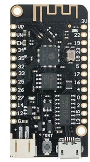
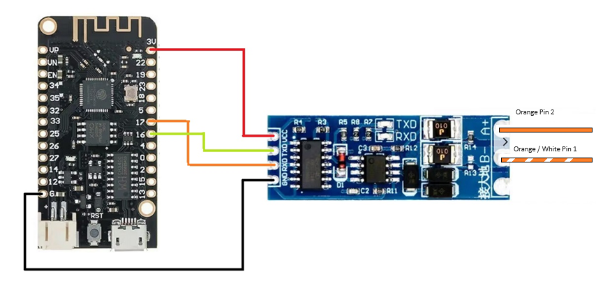
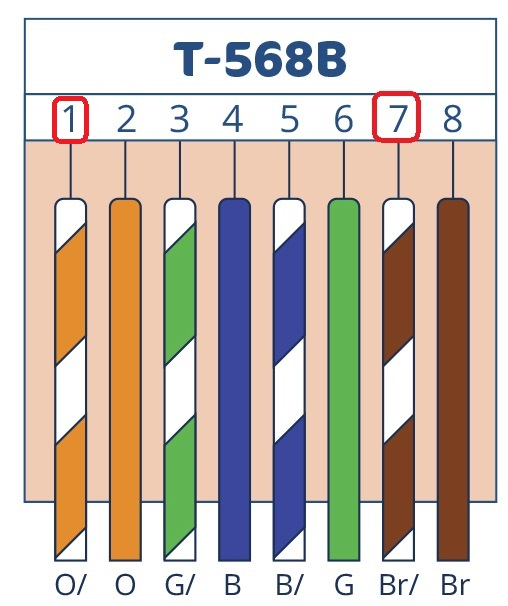
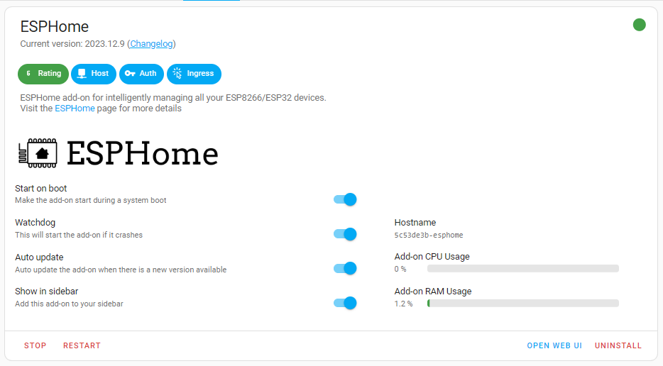
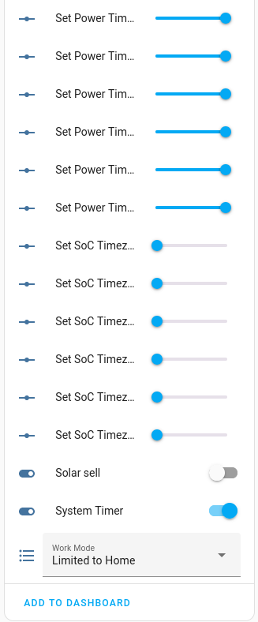
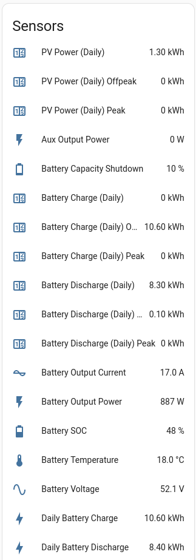
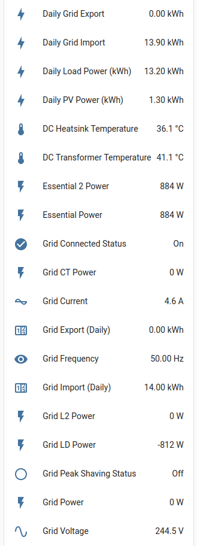
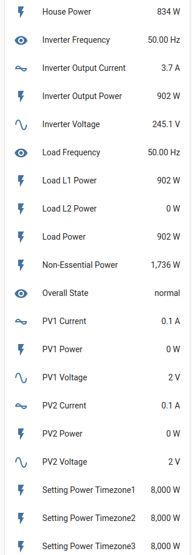
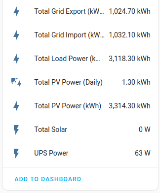

# SunSynk Inverters and Home Assistant ESPHome

This project has been created to allow you to gain back control over your SunSynk Inverter. This applies to 3.68kW / 5.5kW and 8.8kW inverters. (Other models may work)

 

**It should be noted, there are different versions of the each inverter. Some have an all in one BMS 485/CAN port like a picture of this 8.8kW SunSynk Inverter**

**and some have seperate CAN and RS485 ports like this picture of a 5.5kW SunSynk Inverter**

 
 

## Components required

 

WEMOS ESP32 Lite V1.0.0 Lolin32 Wifi Bluetooth Board CH340G MicroPython.

https://kunkune.co.uk/shop/esp32-esp8266/wemos-lolin32-esp32-lite-v1-0-0-wifi-bluetooth-board-ch340g-micropython/?fbclid=IwAR130c3W75-MvHVIQRkaq919oVmQM71DfNW_I4CI16sr6qBjoB76vTmjVCs

 

RS485 module to TTL with Isolation Single Chip Microcontroller UART Serial Port.

https://kunkune.co.uk/shop/communication-boards/rs485-module-to-ttl-with-isolation-single-chip-microcontroller-uart-serial-port/?fbclid=IwAR0-Ap4bn00M6TSlwINBr1PfITM7QJWwbq9NOitrLwNkRpegcCKPePa97Lg

A suitable USB power supply and enclosure.

I also created a 3D printed box which can be downloaded from here https://www.thingiverse.com/thing:6456451

 

## For the SunSynk Inverters with an all in one BMS 485/CAN port
 

You should use these pins and coloured cables

They should be wired like this

You will also be required to splice the cable or purchase an RJ45 splitter* 
The reason behind this is you will not only connect in the ESP32 but you will also need to connect in the existing battery BMS cable.
Luckily the ESP use pins 1 & 2 and the BMS uses pins 4 & 5.

 

## *Not all splitters are equal. 

In this version you can see it's crossed over, this will NOT work.

You will need one like this https://solar-assistant.io/shop/products/deye_rj45_split

 

## For the SunSynk Inverters with Separate CAN & RS485 Ports.
 

You should use these pins and coloured cables

They should be wired like this

 

## Inverter Settings (This covers both types of inverter)

Under the Advance Tab ensure the following settings are set.
Your inverter will need to be rebooted as it will drop into error mode. Once done your inverter will be back to normal.

 

## Flashing the ESP with the Code

Load up the ESPHome Add-ons in Home Assistant.

Click on the ESPHome item in the Home Assistant Side Bar
Now click on **+ New Device**
Click **Open ESPHome Web**
Now plug your ESP device into your PC with a Data Micro USB cable then click **Connect**

Your device should appear as a COM device, if not check this https://bromleysat.com/installing-drivers-for-the-esp32 for help
You will then be prompted to install the ESP device. Following this through.

Once install you will then need to Edit the ESP device in ESP home and then paste in the code https://github.com/iendicott/Home-Assistant/blob/main/SunSynk%20Local%20Control/ESP%20Inverter.yaml

You will need to replace add **!secret** into your Home Assistant config for the code to work.

 

## Connection

Now plug the device via the RJ45 into the inverter and you should see data being displayed. 
You will also have alot of new sensors in Home Assistant with the Prefix **sunsynk logger**

 

## Home Assistant Sensors.

 

 

 

 

 

 

 

Once you have built the product you'll need to install ESP Home on your Home Assistant console and then upload this to your ESP device 
https://github.com/iendicott/Home-Assistant/blob/main/SunSynk%20ESP%20Code/ESP%20Inverter.yaml

 

## Disclaimer.

I cannot accept any responsibility for any damage caused to your equipment. Please install at your own risk.

