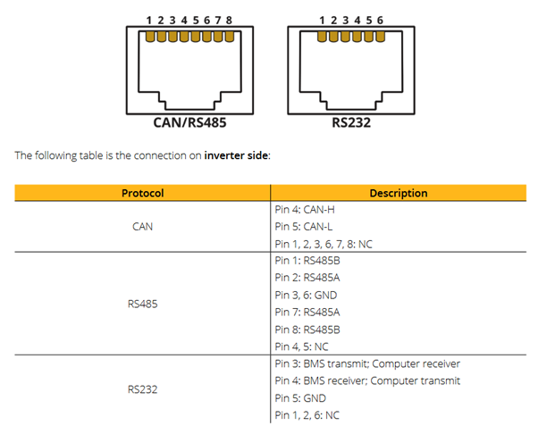

# SunSynk-ESPHome

This project has been created to allow you to gain back control over your SunSynk Inverter. This applies to 3.68kW / 5.5kW and 8.8kW inverters.
Please not though, there are different versions of the inverter that have different ports and pin outs so you will need to check you own one.

## Components.

WEMOS ESP32 Lite V1.0.0 Lolin32 Wifi Bluetooth Board CH340G MicroPython.

https://kunkune.co.uk/shop/esp32-esp8266/wemos-lolin32-esp32-lite-v1-0-0-wifi-bluetooth-board-ch340g-micropython/?fbclid=IwAR130c3W75-MvHVIQRkaq919oVmQM71DfNW_I4CI16sr6qBjoB76vTmjVCs

RS485 module to TTL with Isolation Single Chip Microcontroller UART Serial Port.

https://kunkune.co.uk/shop/communication-boards/rs485-module-to-ttl-with-isolation-single-chip-microcontroller-uart-serial-port/?fbclid=IwAR0-Ap4bn00M6TSlwINBr1PfITM7QJWwbq9NOitrLwNkRpegcCKPePa97Lg

USB power supply and suitable enclosure.

I also created a 3D printed box which can be downloaded from here https://www.thingiverse.com/thing:6456451

## Connections.

## 5.5kW & 8.5kW with combind BMS 2in1 Port.

The 8kW inverter uses a combined BMS 2in1 Port located below.

You should in this case use these pins and coloured cables

If you have the battery and RS485 linking to the same port you maye need to provide a splitter.
## Not all splitter are equal. 

In this version you can see it's crossed over, this will NOT work.

You will need one like this https://solar-assistant.io/shop/products/deye_rj45_split

## Important Note : 5.5kW with Separate CAN & RS485 Ports.

Use Pins 1 & 7 as pin2 isn’t connected on the PCB

Pin1 = Orange/White = (A)

Pin7 = Brown/White = (B)

You should in this case use these pins and coloured cables

## Inverter Settings.

Under the Advance Tab ensure the following settings are set.
Your inverter will need to be rebooted as it will drop into error mode. Once done your inverter will be back to normal.

## Flashing the ESP with the Code

Load up the ESPHome Add-ons in Home Assistant.

Click on the ESPHome item in the Home Assistant Side Bar
Now click on **+ New Device**
Click **Open ESPHome Web**
Now plug your ESP device into your PC with a Data Micro USB cable then click **Connect**

Your device should appear as a COM device, if not check this https://bromleysat.com/installing-drivers-for-the-esp32 for help
You will then be prompted to install the ESP device. Following this through.

Once install you will then need to Edit the ESP device in ESP home and then paste in the code https://github.com/iendicott/Home-Assistant/blob/main/SunSynk%20Local%20Control/ESP%20Inverter.yaml

You will need to replace add **!secret** into your Home Assistant config for the code to work.

## Connection

Now plug the device via the RJ45 into the inverter and you should see data being displayed. 
You will also have alot of new sensors in Home Assistant with the Prefix **sunsynk logger**

## Home Assistant Sensors.

 

 

 

 

 

 

 

Once you have built the product you'll need to install ESP Home on your Home Assistant console and then upload this to your ESP device 
https://github.com/iendicott/Home-Assistant/blob/main/SunSynk%20ESP%20Code/ESP%20Inverter.yaml

## Disclaimer.

I cannot accept any responsibility for any damage caused to your equipment. Please install at your own risk.

